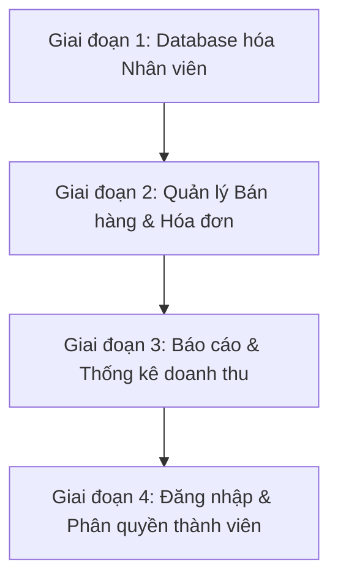

# DANH SÁCH CHỨC NĂNG & KẾ HOẠCH PHÁT TRIỂN (FEATURES & ROADMAP)
## DỰ ÁN HỆ THỐNG QUẢN LÝ SIÊU THỊ SUPERMARKET

Tài liệu này tổng hợp toàn bộ các chức năng hiện có của dự án và lộ trình phát triển, mở rộng các tính năng mới trong tương lai.

---

## 1. CÁC CHỨC NĂNG HIỆN CÓ (CURRENT FEATURES)

### 1.1. Hệ thống & Giao diện chung
* **Trang chào mừng (Welcome Page)**:
  * Giới thiệu tổng quan về mục tiêu và các tính năng nổi bật của hệ thống.
  * Nút điều hướng nhanh đến danh mục sản phẩm.
* **Chế độ giao diện (Dark / Light Theme)**:
  * Hỗ trợ chuyển đổi giao diện sáng/tối mượt mà qua nút bấm trên thanh điều hướng (Navbar).
  * Tự động lưu lựa chọn giao diện vào `localStorage` của trình duyệt.
  * Tự động nhận diện cấu hình sáng/tối của hệ điều hành (nếu chưa được cài đặt thủ công).

### 1.2. Phân hệ Quản lý sản phẩm (Products Catalog)
* **Hiển thị danh sách sản phẩm**:
  * Chế độ xem Lưới (Grid) và Bảng (Table).
  * Lưu trạng thái chế độ xem đã chọn của người dùng vào `localStorage` để tự động khôi phục khi tải lại trang.
* **Tìm kiếm & Bộ lọc**:
  * Tìm kiếm tức thì theo tên sản phẩm (không phân biệt chữ hoa/thường).
  * Bộ lọc danh mục (`category`) được sinh động từ dữ liệu sản phẩm thực tế trong database.
* **Cảnh báo tồn kho**:
  * Tự động hiển thị thẻ trạng thái hàng hóa dựa trên số lượng tồn kho (`quantity`):
    * **Còn hàng (In Stock)**: `quantity > 10` (Thẻ màu xanh).
    * **Sắp hết hàng (Low Stock)**: `1 <= quantity <= 10` (Thẻ màu vàng).
    * **Hết hàng (Out of Stock)**: `quantity = 0` (Thẻ màu đỏ).
* **Quản lý dữ liệu (CRUD)**:
  * **Thêm mới sản phẩm**: Form nhập liệu tại trang `/products/add` có kiểm tra validate dữ liệu đầu vào (tên, danh mục bắt buộc; giá và số lượng phải lớn hơn hoặc bằng 0).
  * **Chỉnh sửa sản phẩm**: Lấy thông tin cũ điền vào form tại trang `/products/edit/:id` để cập nhật.
  * **Xóa sản phẩm**: Có hộp thoại xác nhận trước khi thực hiện xóa.
  * **Lưu trữ dữ liệu**: Đồng bộ trực tiếp với file `db.json` thông qua API của `json-server`.

### 1.3. Phân hệ Quản lý nhân viên (Employees Directory)
* **Hiển thị danh sách nhân sự**:
  * Chế độ hiển thị dạng danh sách thẻ (Grid) và bảng thông tin (Table).
  * Màu sắc thẻ vai trò (Role Badge) tự động thay đổi theo chức vụ (Admin: Đỏ/Crimson, Manager: Xanh dương, Employee: Xanh lá).
  * Hiển thị trạng thái hoạt động (Active: đang làm việc / Inactive: tạm nghỉ).
* **Tìm kiếm & Bộ lọc**:
  * Tìm kiếm đa năng: Kết quả lọc khớp nếu từ khóa xuất hiện trong Họ tên, Vị trí công việc hoặc Email của nhân viên.
  * Bộ lọc theo vai trò (`role` gồm: Admin, Manager, Employee) và lọc theo trạng thái hoạt động (`active` / `inactive`).
* **Quản lý dữ liệu (CRUD)**:
  * Thao tác trực tiếp thông qua **Modal popup** ngay trên trang `/employees`.
  * Validate bắt buộc nhập Họ tên, Email (đúng định dạng) và Số điện thoại.
  * Tự động gán ảnh đại diện (avatar) mặc định nếu để trống.
  * **Hạn chế hiện tại**: Dữ liệu chỉ được lưu tạm trong bộ nhớ (React State) nên sẽ bị mất khi tải lại trang.

---

## 2. KẾ HOẠCH NÂNG CẤP & BỔ SUNG CHỨC NĂNG (ROADMAP)

Lộ trình phát triển được thiết kế theo từng giai đoạn từ nâng cấp hệ thống nền tảng đến bổ sung các nghiệp vụ siêu thị thực tế.

### GIAI ĐOẠN 1: ĐỒNG BỘ CƠ SỞ DỮ LIỆU NHÂN VIÊN (ĐANG LÊN KẾ HOẠCH)
* **Mục tiêu**: Khắc phục hạn chế mất dữ liệu nhân viên khi tải lại trang.
* **Nội dung công việc**:
  1. Thêm mảng dữ liệu `"employees"` vào file cơ sở dữ liệu `db.json`.
  2. Tạo TypeScript interface cho thực thể nhân viên (`src/types/Employee.ts`).
  3. Xây dựng dịch vụ API cho nhân viên (`src/services/employeeService.ts`) để thực hiện các yêu cầu HTTP `GET`, `POST`, `PUT`, `DELETE`.
  4. Cập nhật component `src/pages/Employees.tsx` để tích hợp gọi API thay cho local state.

---

### GIAI ĐOẠN 2: PHÂN HỆ QUẢN LÝ BÁN HÀNG & HÓA ĐƠN (SALES & BILLING)
* **Mục tiêu**: Mô phỏng hoạt động bán lẻ tại quầy của siêu thị, kết nối trực tiếp kho hàng và dòng tiền.
* **Nội dung công việc**:
  1. **Thiết lập bảng hóa đơn (`orders`)**: Bổ sung bảng hóa đơn vào `db.json` để lưu trữ lịch sử giao dịch (Mã đơn, Danh sách sản phẩm mua, Tổng tiền, Ngày giờ giao dịch, Nhân viên thực hiện giao dịch).
  2. **Trang Tạo Đơn Hàng / Bán Hàng**:
     * Giao diện cho phép thủ quỹ chọn sản phẩm từ danh mục sản phẩm có sẵn.
     * Chọn số lượng mua (giới hạn không vượt quá số lượng sản phẩm đang có trong kho).
     * Hiển thị chi tiết đơn hàng, tính tổng tiền tự động.
  3. **Tích hợp trừ kho tự động**: Khi nhấn hoàn thành hóa đơn, hệ thống sẽ thực hiện đồng thời:
     * Gửi yêu cầu lưu hóa đơn mới lên API (`POST /orders`).
     * Gọi API cập nhật giảm số lượng tồn kho (`quantity = quantity - số lượng mua`) của từng mặt hàng tương ứng trong bảng `products`.

---

### GIAI ĐOẠN 3: BÁO CÁO & THỐNG KÊ CHI TIẾT (ANALYTICS DASHBOARD)
* **Mục tiêu**: Cung cấp cái nhìn trực quan bằng biểu đồ và số liệu cho Quản lý siêu thị.
* **Nội dung công việc**:
  1. Xây dựng trang Dashboard tổng quan (thay thế hoặc bổ sung cho trang Welcome).
  2. Tính toán và hiển thị các số liệu thống kê chính (Key Metrics):
     * Tổng số mặt hàng đang bán và Tổng giá trị hàng hóa trong kho.
     * Số lượng mặt hàng đang rơi vào cảnh báo sắp hết hàng (`Low Stock`) hoặc hết hàng (`Out of Stock`).
     * Tổng doanh thu bán hàng tích lũy.
  3. Tích hợp biểu đồ trực quan (ví dụ sử dụng Chart.js hoặc Recharts):
     * Biểu đồ cột: Thống kê doanh thu theo ngày/tháng.
     * Biểu đồ tròn: Cơ cấu doanh thu theo từng danh mục hàng hóa (Drink, Snack, Food...).

---

### GIAI ĐOẠN 4: ĐĂNG NHẬP & PHÂN QUYỀN THÀNH VIÊN (AUTH & AUTHORIZATION)
* **Mục tiêu**: Bảo mật hệ thống, đảm bảo nhân viên chỉ thao tác trong phạm vi công việc được giao.
* **Nội dung công việc**:
  1. Thiết lập bảng tài khoản người dùng (`users`) hoặc tích hợp đăng nhập trực tiếp từ bảng nhân viên (`employees`).
  2. Xây dựng trang Đăng nhập (Login).
  3. Thực hiện phân quyền chức năng theo vai trò (`role`):
     * **Admin (Quản trị viên)**: Được toàn quyền truy cập tất cả các tính năng bao gồm quản lý tài khoản nhân viên, xem báo cáo, quản trị kho và bán hàng.
     * **Manager (Quản lý)**: Có quyền quản lý danh mục sản phẩm (thêm, sửa, xóa sản phẩm), quản lý kho hàng, nhập/xuất kho và xem báo cáo thống kê doanh thu. Không có quyền quản lý tài khoản nhân sự khác.
     * **Employee (Nhân viên)**: Thực hiện các nghiệp vụ hàng ngày bao gồm bán hàng (tạo hóa đơn) và nhập/xuất kho (cập nhật số lượng sản phẩm). Không được phép sửa đơn giá bán, không được xóa sản phẩm hay nhân viên.
